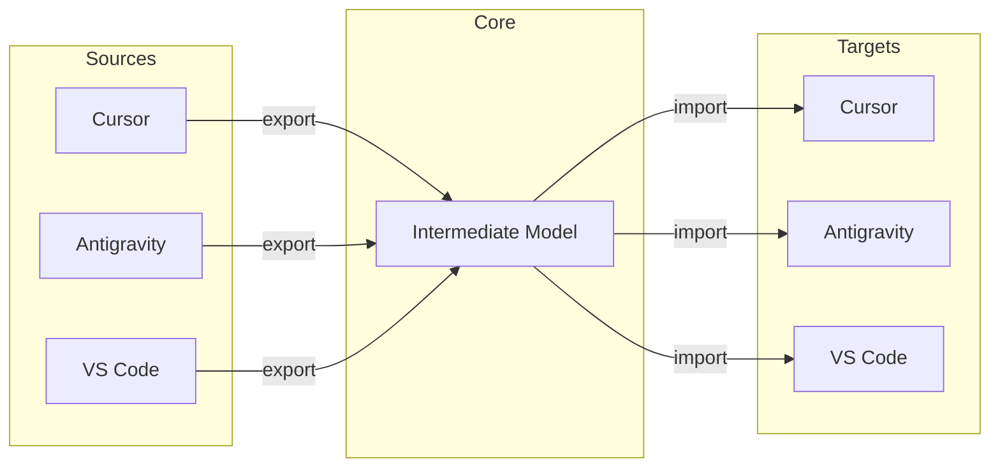
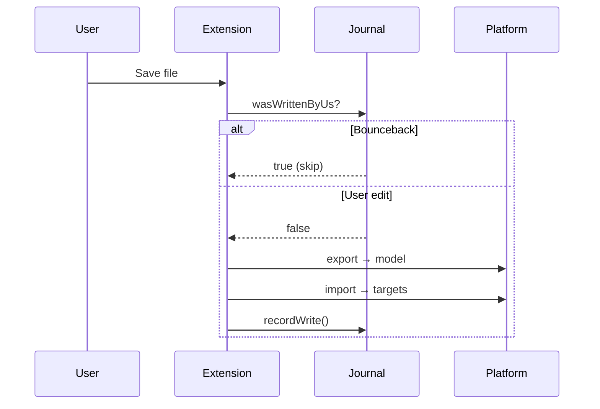

# Architecture

[← Documentation](./README.md) · [README](../README.md)

---

## Overview

Sceny Editor Sync uses an **Intermediate Model** pattern to synchronize AI editor rules between platforms.



Adding a new platform requires only 2 transforms (export + import) instead of N×(N-1).

---

## Project Structure

```
src/
├── extension.ts        # VS Code entry point, event handlers
├── fileSync.ts         # Sync orchestration
├── model.ts            # Intermediate model types
├── transforms.ts       # Frontmatter parsing
├── utils.ts            # Shared utilities
├── journal.ts          # Loop prevention
├── syncLock.ts         # Concurrency control (fs.watch)
├── syncQueue.ts        # Debouncing
├── config.ts           # Settings access
├── logger.ts           # Winston rotating logs
└── platforms/
    ├── index.ts        # Registry and API
    ├── types.ts        # Platform interface
    ├── helpers.ts      # File operations
    ├── cursor.ts       # Cursor platform
    ├── antigravity.ts  # Antigravity platform
    └── vscode.ts       # VS Code platform
```

---

## Data Flow



---

## Key Mechanisms

### Loop Prevention (Journal)
Tracks file writes with size/mtime. Skips if file matches recorded state.

### Concurrency (SyncLock)
Uses `fs.watch` to react immediately when lock is released. Atomic `wx` flag for lock creation.

### Error Boundaries
All event handlers wrapped in try-catch with logger.error.

### Testing
Jest + ts-jest with 21 unit tests covering transforms, utils, and helpers.

---

## Design Decisions

| Decision | Why |
|----------|-----|
| File-based locking | Works across VS Code windows/processes |
| fs.watch for lock | Immediate response, no polling |
| Per-workspace state | Multiple workspaces don't interfere |
| Modular platforms | Easy to maintain and extend |
