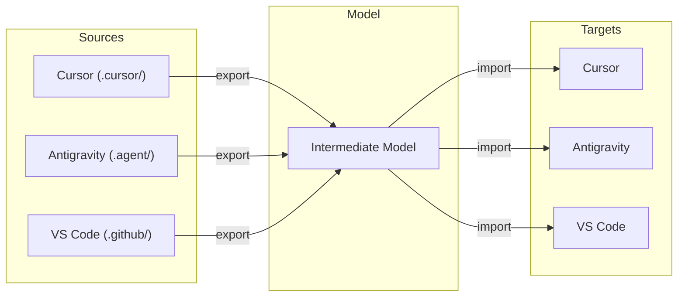
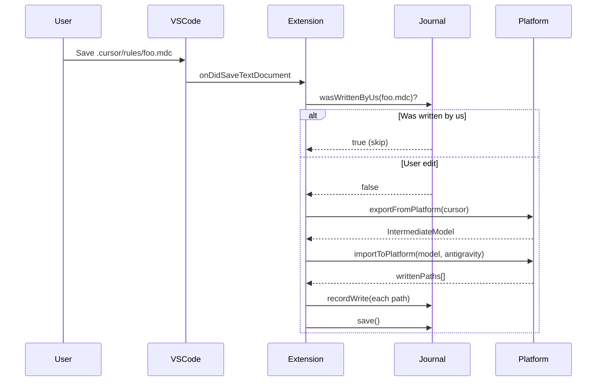

# Architecture

[← Documentation](./README.md) · [README](../README.md)

---

## Overview

Sceny AI Editor Sync uses an **Intermediate Model** pattern to minimize complexity when syncing between N platforms.

### Why Intermediate Model?

Without it, adding a new platform would require N×(N-1) transforms.  
With it, we only need 2×N transforms (export + import per platform).

---

## Components

### Core Files

| File | Responsibility |
|------|----------------|
| `extension.ts` | VS Code extension entry point, event handlers with error boundaries |
| `fileSync.ts` | Sync orchestration, coordinates all operations |
| `model.ts` | Intermediate model types |
| `transforms.ts` | Frontmatter parsing, format conversion |

### Platform Modules (`platforms/`)

| File | Responsibility |
|------|----------------|
| `index.ts` | Platform registry, detection, export/import functions |
| `types.ts` | Platform interface and PlatformId type |
| `helpers.ts` | Shared utilities (findFilesRecursive, ensureDir) |
| `cursor.ts` | Cursor platform implementation |
| `antigravity.ts` | Antigravity platform implementation |
| `vscode.ts` | VS Code Copilot platform implementation |

### Infrastructure

| File | Responsibility |
|------|----------------|
| `utils.ts` | Shared utilities (normalizePath, ensureDir, ensureGitignore) |
| `journal.ts` | Loop prevention via write tracking |
| `syncLock.ts` | Concurrency control via `fs.watch` file locking |
| `syncQueue.ts` | Debouncing, per-file async chains |
| `config.ts` | VS Code settings access |
| `logger.ts` | Winston-based rotating logs |

---

## Data Flow

### On File Save

### Loop Prevention

The journal tracks every file we write with its size and mtime. When a file change is detected:

1. Check if this file was recently written by us
2. Compare current size/mtime with recorded values
3. If match within 2 seconds, skip (it's our own write)
4. If no match, proceed with sync

---

## Design Decisions

### 1. File-Based Locking with fs.watch

**Why**: Multiple VS Code windows can open the same workspace. File locks work across processes.

**How**: Uses `fs.watch` to react immediately when lock is released. The `wx` flag ensures atomic lock creation. 60-second stale lock detection as safety net only.

### 2. Journal for Loop Detection

**Why**: Watcher fires for ALL file changes, including our own writes. Need to distinguish user edits from our writes.

**Source files are also recorded** to prevent redundant syncs when multiple editors have the same workspace open. See [Sync Logic → Why Record Source Files](./sync-logic.md#why-record-source-files-too) for the detailed cross-editor coordination scenario.

### 3. Per-Workspace State

**Why**: Journals, locks, and logs are per-workspace. Allows multiple workspaces without interference.

**Storage**: `.rulessync/` directory (gitignored by default)

### 4. Modular Platform Architecture

**Why**: Each platform has distinct file formats and locations. Separating into modules makes the code easier to maintain and extend.

**Structure**: `platforms/` directory with one file per platform plus shared helpers.
