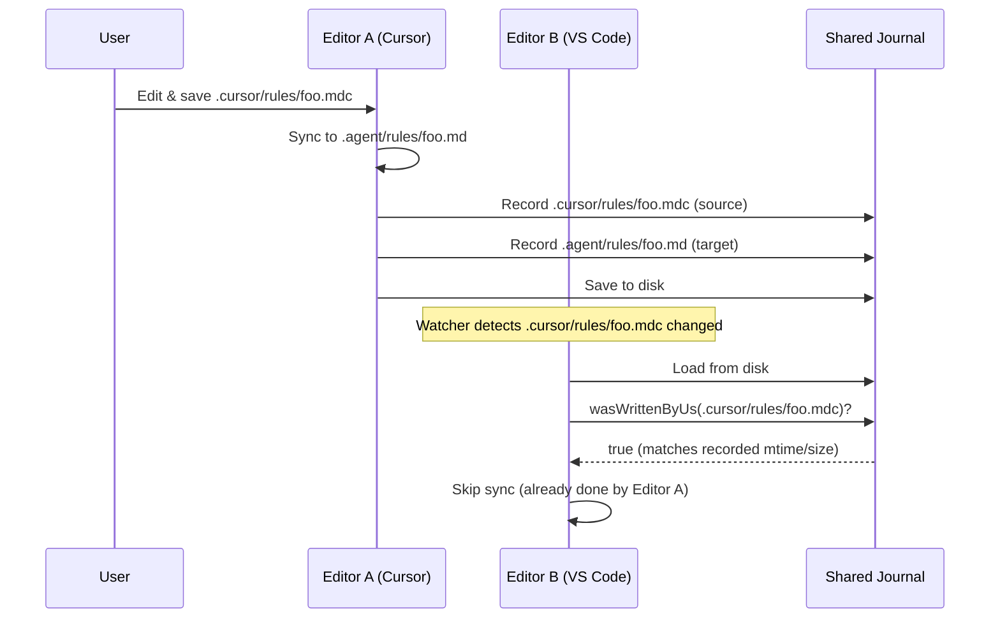

# Sync Logic

[← Documentation](./README.md) · [README](../README.md)

---

## Overview

Synchronization happens through three main triggers:
1. **File save** - User saves a document
2. **File events** - Create, rename, delete
3. **Manual command** - User triggers sync from command palette

## Sync Flow

### 1. Source Detection

When a file change is detected, we determine the source platform from the path:

| Path Pattern | Platform |
|--------------|----------|
| `.cursor/rules/**` or `.cursorrules` | Cursor |
| `.agent/rules/**` or `.agent/workflows/**` | Antigravity |
| `.github/instructions/**` | VS Code |

### 2. Export Phase

Read all files from the source platform and convert to intermediate model:

```typescript
const model = exportFromPlatform('cursor', workspaceRoot);
// model.rules = [{ name, trigger, content, ... }]
// model.workflows = [{ name, description, content, ... }]
```

### 3. Target Detection

Determine which platforms to sync to:

1. If `syncPlatforms` configured → use those
2. Otherwise → auto-detect from available folders

### 4. Import Phase

Write intermediate model to each target platform:

```typescript
for (const targetId of targets) {
    const writtenPaths = importToPlatform(model, targetId, root);
    // writtenPaths = ['/path/to/file1.md', '/path/to/file2.md']
}
```

### 5. Journal Recording

Record all written files to prevent loops:

```typescript
for (const writtenPath of writtenPaths) {
    journal.recordWrite(writtenPath);
}
journal.save();
```

---

## Loop Prevention

### The Problem

When we write a file, the file watcher fires. Without prevention, this would trigger another sync, creating an infinite loop.

### The Solution: Journal

The journal (`SyncJournal`) tracks every file we write:

```typescript
interface FileRecord {
    size: number;      // File size in bytes
    mtime: number;     // Last modified time (ms)
    writtenAt: number; // When we recorded this
}
```

Before syncing, we check if the triggering file matches our record:

```typescript
if (journal.wasWrittenByUs(filePath)) {
    return; // Skip - this is our own write
}
```

### Matching Logic

A file is considered "written by us" if:
1. We have a record for this relative path
2. Current file size matches recorded size
3. Current mtime is within 2 seconds of recorded mtime

### Why Record Source Files Too?

Source files are also recorded to prevent redundant syncs across multiple editor instances sharing the same workspace.

**Scenario: Multiple Editors Open**



**Why This Matters:**

1. **Same workspace, different windows** - Users often have Cursor and VS Code open on the same project
2. **File watchers see everything** - Both editors' extensions detect the source file change
3. **Journal is shared on disk** - `.rulessync/journal.json` is readable by all instances
4. **Prevents duplicate work** - Without source recording, both editors would sync the same change

**Key Insight:** The journal on disk (`journal.json`) acts as cross-process coordination. When Editor A records a file and saves the journal, Editor B can read it and know "someone already processed this file with this exact content."

---

## Concurrency Control

### File Lock

The `SyncLock` ensures only one sync operation runs at a time per workspace:

```typescript
await lock.withLock(async () => {
    // Only one operation runs here at a time
});
```

### Stale Lock Detection

If a lock file is older than 30 seconds, it's considered stale and removed.

### Sync Queue

The `SyncQueue` provides per-file debouncing:

1. Multiple rapid saves → only last one syncs
2. Unchanged files → skip sync
3. Chained promises → prevent concurrent syncs of same file

---

## Deletion Handling

When a source file is deleted:

1. Determine base name (e.g., `foo` from `.cursor/rules/foo.mdc`)
2. Calculate corresponding target paths (e.g., `.agent/rules/foo.md`)
3. Delete those target files
4. Remove from journal

---

## Rename Handling

When a source file is renamed:

1. Call `handleDeletion(oldUri)` → deletes old targets
2. Call `syncFileByUri(newUri)` → creates new targets
